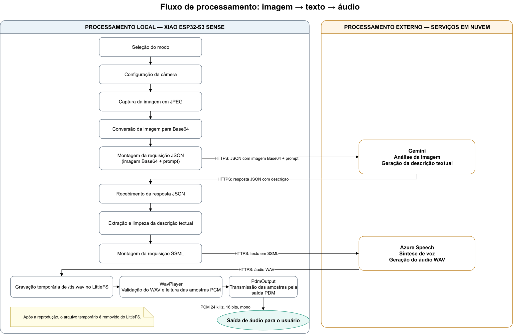

# Smart Cane 

Este projeto consiste no desenvolvimento de um <strong>dispositivo assistivo baseado na placa Seeed Studio XIAO ESP32-S3 Sense</strong>, com o objetivo de auxiliar pessoas com deficiência visual na interpretação de informações presentes no ambiente. Para isso, o sistema utiliza uma câmera para capturar imagens e processá-las de acordo com diferentes modos de funcionamento, permitindo obter descrições de objetos, textos e características do espaço ao redor.

## 1. Resumo do Projeto

#### Objetivo

Este projeto apresenta o desenvolvimento de um protótipo de dispositivo assistivo voltado ao apoio de pessoas com deficiência visual na interpretação de informações presentes no ambiente. A proposta foi concebida como uma etapa inicial para uma possível integração futura a uma <strong>Smart Cane</strong>, explorando o uso de hardware embarcado de baixo custo, visão computacional e retorno auditivo como recursos de acessibilidade.

#### Funcionamento geral

O dispositivo é baseado na placa Seeed Studio XIAO ESP32-S3 Sense e utiliza uma câmera para capturar informações visuais do ambiente. A partir dessas imagens, o sistema pode gerar descrições de objetos, textos e características do espaço ao redor. As informações produzidas podem ser apresentadas ao usuário por meio de áudio. 

#### Tecnologias utilizadas

Durante o desenvolvimento, foram estudados temas relacionados a sistemas embarcados, visão computacional, inteligência artificial em nuvem, TinyML, comunicação com APIs, síntese de voz, formatos digitais de áudio e gerenciamento de memória em microcontroladores.

Entre as principais tecnologias utilizadas estão a XIAO ESP32-S3 Sense, o framework Arduino com PlatformIO, o Gemini para análise de imagens, o Azure Speech para síntese de voz, o Edge Impulse para inferência local e o LittleFS para armazenamento temporário.

Para mais detalhes sobre hardware, software e fluxo de processamento do projeto, consulte a seção [Sistema Desenvolvido](#2-sistema-desenvolvido).

#### Resultados

Como resultado, foi obtido um protótipo funcional capaz de capturar imagens, produzir descrições textuais, convertê-las em áudio. O projeto também permitiu avaliar limitações relacionadas ao tempo de resposta, à conectividade, aos recursos de memória e à integração entre diferentes módulos de software.

O modelo de detecção de objetos foi treinado, porém não foi incluído no 

Para mais detalhes, consulte a seção [Resultados](#3-resultados).

## 2. Sistema Desenvolvido

O sistema desenvolvido possui uma arquitetura híbrida e modular, combinando processamento realizado localmente no dispositivo com serviços executados em nuvem. A placa Seeed Studio XIAO ESP32-S3 Sense atua como unidade central do protótipo, sendo responsável pelo controle da câmera, seleção dos modos de funcionamento, conexão com a rede Wi-Fi, comunicação com serviços externos, armazenamento temporário de arquivos e reprodução do áudio.

O sistema oferece diferentes modos de captura e análise de imagem que utilizam a câmera para capturar uma imagem posteriormente enviada ao Gemini para geração de uma descrição textual. Cada modo aplica uma configuração específica à câmera e utiliza um prompt correspondente ao tipo de informação desejada:

1. **Apoio à mobilidade e identificação de riscos**

   O primeiro modo é voltado ao auxílio durante o deslocamento do usuário. A imagem capturada é analisada com prioridade para obstáculos, degraus, buracos, portas, passagens e outros elementos que possam representar risco imediato.

   O sistema também busca indicar a direção mais livre para seguir, produzindo uma resposta curta e objetiva para facilitar a compreensão por áudio.

2. **Leitura e análise de objetos próximos**

   O segundo modo é destinado à análise de objetos posicionados próximos à câmera. Sua configuração procura favorecer a captura de detalhes e textos presentes em embalagens, placas, documentos ou outros objetos.

   O Gemini recebe uma solicitação para identificar o objeto principal, verificar a presença de texto e descrever seu estado ou suas características mais relevantes.

3. **Descrição geral do ambiente**

   O terceiro modo utiliza uma configuração voltada à captura de cenas mais amplas. Seu objetivo é oferecer uma descrição geral do ambiente, destacando objetos, locais, pessoas ou acontecimentos relevantes presentes na imagem.

O quarto modo utiliza um fluxo diferente dos demais. Em vez de enviar a imagem para um serviço externo, o dispositivo executa localmente um modelo de visão computacional desenvolvido no Edge Impulse: 

4. **Inferência local**

   Nesse modo, a imagem é capturada, preparada e fornecida ao classificador embarcado, que retorna as classes detectadas, suas probabilidades e, quando aplicável, a localização dos objetos na imagem. Na versão atual, o resultado da inferência é exibido no Monitor Serial e ainda não é encaminhado ao sistema de áudio.
   
### 2.1 Fluxo de processamento

A arquitetura do sistema contempla três fluxos principais: 
1. **Fluxo de imagem para texto:** a câmera captura uma imagem em formato JPEG, que é convertida para Base64 no ESP32-S3. A imagem codificada e o prompt correspondente ao modo selecionado são organizados em uma requisição JSON e enviados ao Gemini por meio de uma conexão HTTPS. O serviço processa a imagem na nuvem e retorna uma resposta em JSON, da qual o dispositivo extrai a descrição textual.

2. **Fluxo de texto para áudio:** a descrição produzida pelo Gemini é extraída e encaminhada ao Azure Speech em uma requisição SSML. O serviço realiza a síntese de voz na nuvem e retorna um arquivo WAV contendo áudio PCM mono, com 16 bits e taxa de amostragem de 24 kHz. O arquivo é armazenado temporariamente no LittleFS, validado e interpretado pelo `WavPlayer`. As amostras PCM são então transmitidas pelo módulo `PdmOutput` por meio da saída PDM. Após a reprodução, o arquivo temporário é removido.

3. **Fluxo de inferência local:** a imagem capturada é processada diretamente no ESP32-S3 por meio de um modelo desenvolvido no Edge Impulse. Nesse fluxo, não há envio da imagem para serviços externos.

### 2.2 Arquitetura de Hardware

Os componentes utilizados para a elaboração do protótipo são descritos na tabela abaixo: 

| Componente | Função no projeto |
|---|---|
| Seeed Studio XIAO ESP32-S3 Sense | Processamento central, conectividade Wi-Fi e controle dos periféricos |
| Câmera do módulo Sense | Captura de imagens para processamento em nuvem e inferência local |
| Interface de áudio PDM | Transmissão digital das amostras de áudio |
| Fones ou caixa de som utilizada nos testes | Reprodução da resposta auditiva |
| Cabo USB | Alimentação, programação e comunicação com o Monitor Serial |
| Jumpers e conexões | Interligação entre a placa e a saída de áudio |

As conexões executadas são ilustradas na tabela abiaxo e no diagrama: 
| Sinal | Pino da XIAO ESP32-S3 |
|---|---|
| Dados PDM | GPIO 1 |
| Clock PDM | GPIO 2 |
| Terra | GND |

#### Placa principal e Sistema de captura de imagem
A unidade central do protótipo é a 
[Seeed Studio XIAO ESP32-S3 Sense](https://wiki.seeedstudio.com/xiao_esp32s3_getting_started/#xiao-esp32-s3-sense-front). Sua escolha esteve relacionada principalmente à integração entre o microcontrolador ESP32-S3 e o módulo de câmera, às dimensões compactas e à disponibilidade de conectividade Wi-Fi. 

A câmera integrada ao módulo Sense atua como principal dispositivo de entrada do sistema. Nos modos 1, 2 e 3, ela é configurada para capturar imagens em formato JPEG e resolução QXGA, utilizando dois buffers de imagem. A escolha do formato JPEG reduz o tamanho dos dados antes do envio ao serviço de análise em nuvem. Antes de cada captura, o software aplica configurações específicas de exposição e balanço de branco conforme o modo selecionado. Após os ajustes, o sistema aguarda brevemente a estabilização do sensor antes de capturar a imagem.

#### Circuito de saída de áudio

A saída auditiva do protótipo é realizada por meio de uma interface PDM controlada pelo ESP32-S3. O circuito utiliza linhas digitais de dados e clock, além de uma referência comum de terra, para encaminhar o sinal ao dispositivo de reprodução utilizado nos testes.

A escolha dessa abordagem permitiu desenvolver a reprodução de áudio diretamente a partir dos recursos disponíveis no microcontrolador, sem a adoção do módulo amplificador com DAC inicialmente considerado. O áudio recebido do serviço de síntese de voz é convertido pelo software em amostras PCM, que são transmitidas pelo periférico configurado para a saída PDM.

Para mais detalhes sobre a técnica PDM e referências utilizadas, consulte a sessão [Subprojetos e testes](desenvolvimento.md#2-subprojetos-e-testes).

### 2.3 Arquitetura de Software

#### Organização Modular

O software foi estruturado de forma modular, separando as responsabilidades relacionadas à captura de imagens, comunicação com serviços externos, tratamento de respostas, síntese e reprodução de áudio e inferência local. O arquivo `main.cpp` atua como controlador central, inicializando os recursos, recebendo a seleção do modo e acionando os módulos correspondentes.

Essa organização permitiu desenvolver e testar partes do sistema separadamente antes de integrá-las ao fluxo completo. A tabela a seguir apresenta as principais responsabilidades de cada módulo.

| Módulo | Responsabilidade |
|---|---|
| `main.cpp` | Controla a inicialização do sistema, recebe o modo selecionado e coordena a execução dos demais módulos. |
| `Camera` | Inicializa e configura a câmera, aplica os modos de captura, registra a fotografia e converte a imagem para Base64. |
| `WifiManager` | Gerencia a conexão Wi-Fi, envia a imagem e o prompt ao Gemini e conduz o início do fluxo de síntese de voz. |
| `Utilities` | Armazena os prompts utilizados nos diferentes modos e extrai o texto útil da resposta retornada pelo Gemini. |
| `AzureTtsClient` | Envia o texto ao Azure Speech e grava o áudio retornado em um arquivo WAV no LittleFS. |
| `WavPlayer` | Abre o arquivo WAV, interpreta seu cabeçalho e encaminha os dados PCM para reprodução. |
| `PdmOutput` | Configura o periférico de áudio e transmite as amostras PCM por meio da saída PDM. |
| `SignInference` | Captura a imagem e executa localmente o modelo de detecção desenvolvido no Edge Impulse. |
| `LittleFS` | Armazena temporariamente o arquivo WAV gerado pelo serviço de síntese de voz. |
| `secrets.h` | Mantém as credenciais da rede Wi-Fi e das APIs separadas do código principal. |

#### Modelo de Inferência Local

O modo 4 utiliza um modelo de detecção de objetos desenvolvido e treinado na plataforma [Edge Impulse](https://www.edgeimpulse.com). Após o treinamento, a plataforma gera uma biblioteca compatível com sistemas embarcados, contendo a estrutura do modelo, os parâmetros aprendidos e as funções necessárias para executar a inferência no microcontrolador.

No firmware, o módulo `SignInference` realiza a integração entre a câmera e a biblioteca exportada. A imagem capturada em formato JPEG é convertida para RGB888, redimensionada para as dimensões de entrada exigidas pelo modelo e fornecida ao classificador por meio de uma função de leitura de pixels.

A execução retorna a classe detectada e os valores de confiança. O processamento ocorre localmente, sem o envio da imagem para serviços externos.

Para mais detalhes sobre o treinamento do modelo de detecção de objetos, consulte a sessão [Subprojetos e testes](desenvolvimento.md#2-subprojetos-e-testes).

#### Decisões de arquitetura

Algumas decisões foram adotadas para reduzir o acoplamento entre os módulos e adequar o sistema às limitações do microcontrolador:

- **Organização modular:** câmera, comunicação, síntese de voz, reprodução e inferência foram mantidas em módulos distintos. Isso facilitou a realização de testes isolados e reduziu o impacto de alterações em uma funcionalidade sobre as demais.

- **Armazenamento temporário no LittleFS:** o áudio retornado pelo Azure Speech é salvo em um arquivo temporário, permitindo que o conteúdo seja recebido e posteriormente lido em blocos durante a reprodução. Após o uso, o arquivo é removido para liberar espaço.

- **Separação entre `WavPlayer` e `PdmOutput`:** o `WavPlayer` é responsável pela interpretação do formato WAV e pela obtenção das amostras PCM, enquanto o `PdmOutput` cuida apenas da configuração do periférico e da transmissão dessas amostras. Essa separação evita misturar o tratamento do arquivo com o controle da saída física de áudio.

## 3. Resultados

#### Validação do sistema integrado

Os testes realizados permitiram validar o fluxo integrado de captura de imagem, geração de descrição textual e reprodução da resposta em áudio. Nos modos baseados em serviços de nuvem, a XIAO ESP32-S3 Sense foi capaz de capturar imagens, enviá-las ao Gemini juntamente com o prompt correspondente ao modo selecionado e receber uma descrição da cena.

O texto retornado foi encaminhado ao Azure Speech, que gerou um arquivo WAV armazenado temporariamente no LittleFS. O arquivo foi interpretado pelo módulo de reprodução, e suas amostras PCM foram transmitidas pela saída PDM. Após a reprodução, o arquivo temporário foi removido.

Também foi verificado que a alteração dos prompts permite direcionar o conteúdo das respostas para diferentes objetivos, como identificação de riscos durante o deslocamento, análise de objetos próximos e descrição geral do ambiente.

O fluxo de processamento em nuvem foi validado de forma completa. Durante os testes, o dispositivo capturou imagens, enviou os dados ao Gemini e recebeu descrições coerentes com as cenas observadas. As descrições retornadas foram encaminhadas ao Azure Speech e convertidas em arquivos de áudio reproduzidos pelo protótipo.

A integração com o LittleFS permitiu armazenar temporariamente o arquivo WAV recebido. Após a leitura e reprodução das amostras PCM pela saída PDM, o arquivo foi removido, liberando novamente o espaço de armazenamento.

Os testes também demonstraram que os modos de descrição conseguem alterar o foco da resposta por meio das configurações de câmera e dos prompts enviados ao Gemini. Dessa forma, o sistema pode priorizar informações relacionadas à mobilidade, objetos próximos ou características gerais do ambiente.

#### Desempenho e tempos de resposta

Falar sobre recursos de memória
Para avaliar o comportamento do sistema, foram adicionadas medições de tempo às principais etapas do fluxo. Em uma execução de teste, foram obtidos os seguintes valores:

| Etapa do processamento | Tempo observado |
|---|---:|
| Configuração da câmera | 261 ms |
| Captura e conversão para Base64 | 312 ms |
| Requisição ao Gemini | 9,547 s |
| Geração e download do áudio pelo Azure Speech | 37,892 s |
| Reprodução do áudio | 17,372 s |
| Fluxo completo | 65,808 s |

Os valores correspondem a uma execução específica e podem variar de acordo com a qualidade da conexão, a disponibilidade dos serviços, o tamanho da imagem, a extensão do texto gerado e a duração do áudio.

As medições indicam que a captura e a preparação da imagem representam uma parcela pequena do tempo total. A maior latência ocorre na síntese de voz, no download do arquivo e na reprodução do áudio.

### 3.4 Limitações atuais

Apesar da validação dos principais fluxos, o protótipo ainda apresenta limitações relacionadas ao uso de serviços externos e ao estágio atual de integração.

- os modos de descrição e síntese de voz dependem de conexão Wi-Fi e do acesso ao Gemini e ao Azure Speech;
- o tempo de resposta pode variar conforme a rede e a disponibilidade dos serviços;
- o tempo até o início da reprodução ainda é elevado para uma aplicação de assistência em tempo real;
- o espaço disponível no LittleFS limita o tamanho dos arquivos de áudio que podem ser armazenados;
- a inferência local ainda não produz uma resposta auditiva;
- o modo de inferência apresenta um problema pendente na desinicialização da câmera;
- a seleção dos modos ainda é realizada pelo Monitor Serial;
- o sistema foi validado como protótipo de bancada, sem alimentação portátil, controles físicos, carcaça ou fixação em uma bengala;
- ainda não foi realizada uma avaliação formal com usuários do público-alvo.

## 4. Documentação Complementar 

O sistema foi desenvolvido de forma incremental, com testes separados dos módulos antes da integração. Mais detalhes estão disponíveis na
[documentação de desenvolvimento](docs/desenvolvimento.md). 
